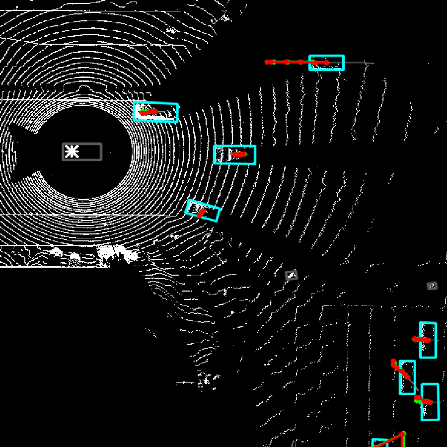
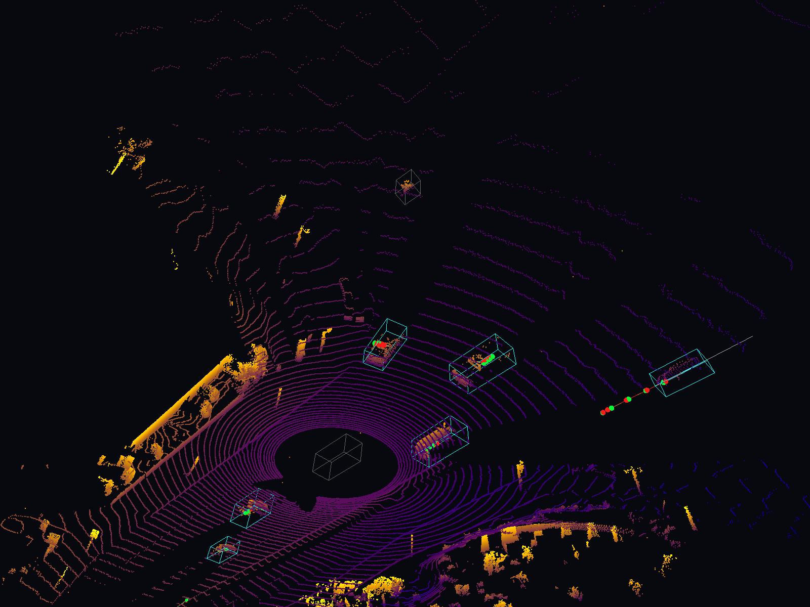

# MOTF — Avances: modelo gated, limpieza de datos y visualizaciones

Documento de avances del proyecto **MOTF** (Moving Object Trajectory Forecasting):
predicción de trayectorias a partir de LiDAR 4D, adaptando **Sapiens** (MAE + ViT)
de Meta al dominio de nubes de puntos.

Última actualización: 2026-06-05

---

## 1. Resumen ejecutivo

En esta etapa se logró:

1. **Diagnosticar y corregir un colapso** del modelo de atención (la rama de escena
   ahogaba la señal del histórico → predecía una constante).
2. **Rediseñar la arquitectura** con normalización + proyección + un *gate* aprendible
   que garantiza que el modelo nunca sea peor que el baseline.
3. **Descubrir y corregir un bug de datos** serio (asociación de objetos por índice de
   frame en vez de track ID persistente) que corrompía ~35% de las trayectorias.
4. **Tres visualizaciones** de las predicciones: dashboard BEV estilo `show_point_cloud`,
   vista 3D Open3D, y predicciones dibujadas dentro del visor C++ interactivo.
5. **Recuperar un dataset multi-escena** (10 escenas, 103 objetos válidos) que habilita
   por fin la prueba real de la hipótesis.

---

## 2. Arquitectura

El encoder es un **ViT de 24 capas, `embed_dim=1024`, ~302M parámetros** (`sapiens_0.3b`),
pre-entrenado con MAE. El modelo de predicción tiene **dos ramas que se fusionan**:

```
            ESCENA (contexto LiDAR)                  OBJETO (su pasado)
   ┌────────────────────────────────┐      ┌──────────────────────────┐
   │ vóxeles (300 × 5 frames)        │      │ historia (5 frames × xyz) │
   │   patch_embed: Linear(5→1024)   │      │         = 15 dims          │
   │   + pos_embed                   │      └────────────┬─────────────┘
   │   ViT 24 capas (MAE, CONGELADO) │             history_proj(15→1024)
   │   → 300 tokens × 1024  ─────────┼──→ CROSS-ATTENTION (query = objeto,
   └────────────────────────────────┘         keys/values = escena)
                                                          │
                                       LayerNorm → Linear(1024→64)
                                       → gate = tanh(scene_gate)   [arranca en 0]
                                                          │
                                  concat [ escena(64) + historia(15) ]
                                                          │
                                       DECODER MLP (4 capas) → futuro (5 × xyz)
```

### ¿Por qué vóxeles?

Una nube LiDAR son ~170.000 puntos sin orden; un Transformer necesita una secuencia fija
de tokens. **Voxelizar** convierte el espacio en una rejilla 3D de ocupación:

- Espacio: ±10 m en X/Y, −2 a 4 m en Z, celdas de 2 m → **10 × 10 × 3 = 300 vóxeles**
- Cada vóxel = 1 si hay algún punto, 0 si está vacío (ocupación binaria)
- **4D**: se apilan 5 frames → cada vóxel es un vector temporal de 5 dims que codifica
  cómo cambió la ocupación en el tiempo (captura movimiento)

### El gate (corrección clave)

`scene_gate` se inicializa en 0 → `tanh(0) = 0` → el modelo **arranca ignorando la escena**
(se comporta como el baseline) y solo "abre" la rama de escena si reduce la pérdida.
Esto garantiza un *fallback* al baseline y evita el colapso.

Archivos:
- `sapiens/pretrain/mmpretrain/models/backbones/mae_vit_4d.py` — encoder MAE 4D
- `sapiens/pretrain/mmpretrain/models/trajectory_pred/trajectory_model_attn.py` — modelo con atención + gate
- `sapiens/pretrain/mmpretrain/models/trajectory_pred/baseline_model.py` — baseline MLP

---

## 3. Metodología

Pipeline de dos etapas:

1. **Pre-entrenamiento auto-supervisado (MAE):** se enmascara el 75% de la escena y el
   modelo aprende a reconstruir lo que falta. Sin etiquetas.
2. **Fine-tuning supervisado:** con el encoder pre-entrenado, se predicen las trayectorias.

Validación **incremental** (orden de la tutora): waymo_10 → waymo_100 → waymo_1000,
validando cada componente antes de escalar. Se compara contra baselines para aislar el
aporte de cada pieza.

---

## 4. Resultados (waymo_10, 1 escena, datos limpios)

Métrica ADE/FDE en metros sobre los **11 objetos válidos** (tras filtrar corruptos):

| Modelo | ADE | FDE | ¿Usa escena? |
|---|---|---|---|
| **Baseline MLP** | **0.113 m** | 0.138 m | No |
| Atención sin pretrain (lr 1e-4) | colapsó (~8.5) | — | sí (rota) |
| Atención gated + pretrain | 0.148–0.190 m | 0.203 m | gate ≈ 0 (no la usa) |

**Lectura honesta:** en **una sola escena** el contexto LiDAR no puede ayudar (no hay
variación entre escenas que explotar), por eso el gate se cierra solo y el baseline
—más simple— gana por poco. Esto **no refuta la hipótesis**: waymo_10 con una escena
solo valida el pipeline. La prueba real exige **multi-escena** (ver sección 6).

---

## 5. Bug de asociación de datos (importante)

Los bbox en `objs_bbox/<escena>/<frame>/<N>.txt` usan un **índice por frame**, no el
**track ID persistente** de Waymo. Cuando un objeto desaparece, los índices se corren y
el "mismo" id `N` salta a otro auto físico (saltos de 60–124 m entre frames).

- Afectaba 6 de 17 objetos en la escena de prueba.
- El `clip[-5,5]` de la normalización **enmascaraba** el problema (capaba los saltos),
  por eso el ADE parecía bueno.
- **Síntoma visual:** líneas verdes (GT real) cruzando toda la imagen en el visor.

**Corrección:** filtro `max_jump=5.0` (m / ~0.1 s = 180 km/h) en `TrajectoryDataset`
que mide el salto en coordenadas **globales** y descarta tracks corruptos.

> Solución correcta a futuro: re-extraer con track IDs persistentes de Waymo.

Archivo: `sapiens/pretrain/mmpretrain/datasets/trajectory_dataset.py`

---

## 6. Dataset

Es **Waymo WOMD-LiDAR** (Waymo Open Motion Dataset con LiDAR), confirmado por:
- **169.600 puntos/frame** = 64 × 2650 → LiDAR TOP de **64 beams** de Waymo
- Scripts de extracción usan la API `waymo_open_dataset`
- 11 frames ≈ 1 s → WOMD-LiDAR solo provee LiDAR para el primer 1 s de cada escena de 9 s
  (esto explica las trayectorias cortas, ~0.5 s)

Es la opción **más óptima** para este trabajo (purpose-built para forecasting desde LiDAR
crudo). Para escalar el pre-entrenamiento MAE, una alternativa sería **Argoverse 2 LiDAR**
(20k secuencias sin etiquetar).

**Estado actual de los datos:**
- `waymo_10`: ahora **11 escenas** con LiDAR (10 usables tras filtro), **103 objetos válidos**
- Etiquetas (bbox/poses) disponibles para 496 escenas; el LiDAR es lo que falta extraer
- Nomenclatura: waymo_10 / 100 / 1000 = número de **escenas**

---

## 7. Visualizaciones

### 7.1 Dashboard BEV estilo `show_point_cloud` (con predicciones)



Puntos blancos = LiDAR (vista cenital), cajas cian = autos, 🔴 roja = predicción,
🟢 verde = real. Como las predicciones son buenas, la roja casi tapa la verde.

```bash
conda activate sapiens_final
python sapiens/pretrain/export_predictions_npz.py attn          # exporta predicciones
python sapiens/pretrain/viz_dashboard_cpp_style.py attn         # genera dashboard PNG
```

### 7.2 Vista 3D (Open3D)



Nube de puntos 3D coloreada por altura + autos como cajas 3D wireframe.

```bash
# Paso 1 (sapiens_final): exportar
conda activate sapiens_final
python sapiens/pretrain/export_predictions_npz.py attn
# Paso 2 (lidar_mae, tiene open3d): render
conda activate lidar_mae
python sapiens/pretrain/viz_3d_open3d.py attn               # PNG
python sapiens/pretrain/viz_3d_open3d.py attn --interactive # ventana girable
```

### 7.3 Predicciones dentro del visor C++ interactivo

```bash
# 1. exportar trayectorias en coords globales (env sapiens_final)
conda activate sapiens_final
python sapiens/pretrain/export_predictions_global.py attn
# 2. compilar (solo la primera vez)
make show_point_cloud
# 3. correr el visor (relee el .txt al iniciar; no hace falta recompilar al re-exportar)
DISPLAY=:1 ./show_point_cloud --input waymo_10 -v 500
```

Controles: **espacio** pausa · **a/d** frame anterior/siguiente · **b** bboxes ·
**t** alternar predicciones · **Esc** salir.

---

## 8. Instrucciones de entorno

- **`sapiens_final`** (Python 3.10): entrenamiento e inferencia (PyTorch 2.5.1, mmcv 2.2.0).
  ⚠️ PyTorch instalado es build **CPU-only**. Hay GPU (RTX 4060 8 GB) pero falta instalar
  PyTorch con CUDA.
- **`lidar_mae`**: tiene `open3d` 0.19 para las visualizaciones 3D.

El visor C++ requiere OpenCV + PCL. Si falla el link por `boost_signals` (eliminado en
Boost moderno), ya está corregido en el `Makefile`.

---

## 9. Próximos pasos

1. **Activar GPU**: instalar PyTorch CUDA (RTX 4060 disponible) — bajaría el entrenamiento
   de ~4 h a minutos. Hacerlo en un entorno paralelo para no romper `sapiens_final`.
2. **Reentrenar en multi-escena** (10 escenas, 103 objetos): aquí se prueba de verdad si
   el contexto de escena ayuda y si el gate se abre.
3. **(Opcional)** Re-pretrenar el MAE sobre las 10 escenas (el actual fue sobre 1 escena).
4. **Escalar** a waymo_100/1000 re-extrayendo WOMD-LiDAR con track IDs persistentes.
