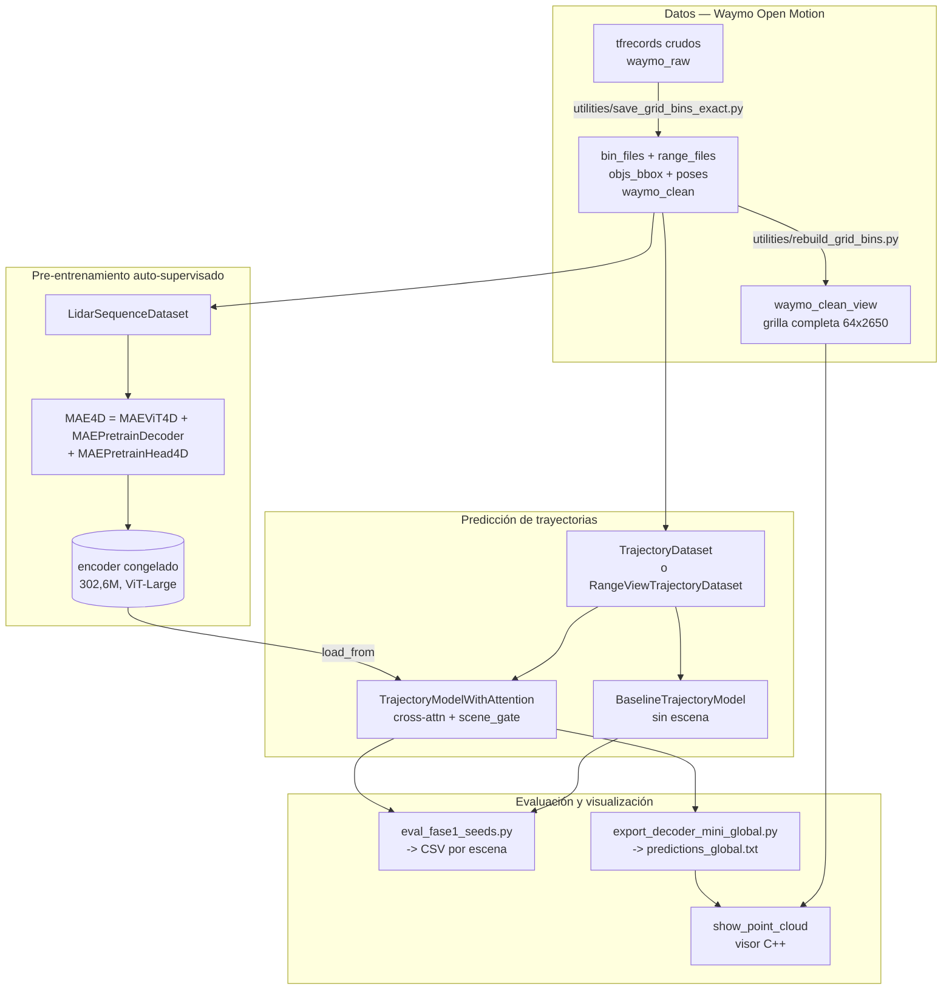

# Mapa del código — MOTF

> Generado por Cartographer. Último mapeo: 2026-09-02. Modo actualización: tres
> agentes en paralelo — auditoría del código nuevo, pipeline de extracción de
> Waymo, y viabilidad de los datos de CARMEN_LCAD. El objetivo de esta pasada no
> fue re-mapear el código sino **recalcular la ruta**: los tres resultados
> negativos del 01-02/09 cierran la línea de variantes de arquitectura y mueven la
> pregunta a de dónde salen los datos. Ver "La ruta" al final.

**Alcance.** Este mapa cubre el **código propio del proyecto**: 185 archivos, ~192k
tokens. Deja fuera a propósito el `mmpretrain` vendido (cientos de archivos de
ImageNet, CLIP, BLIP, ViG y demás que nunca tocamos) y los datasets. Si buscás algo
que no está acá, probablemente sea código de Sapiens sin modificar.

| grupo | archivos | dónde |
|---|---|---|
| Visor C++ | 10 | raíz del repo |
| Pipeline de datos | 23 | `utilities/` |
| Scripts de experimentos | 62 | `sapiens/pretrain/*.{py,sh}` |
| Núcleo MOTF | 13 | `sapiens/pretrain/mmpretrain/{datasets,models}/` |
| Configs de experimentos | 75 | `sapiens/pretrain/configs/sapiens_mae/lidar/` |
| Hooks de Claude Code | 2 | `.claude/hooks/` |

---

## Panorama del sistema



**La pregunta que el código existe para responder:** ¿la escena LiDAR, codificada
por un MAE auto-supervisado, aporta a la predicción de trayectorias sobre un
baseline puramente cinemático? Toda la arquitectura está montada para medir eso de
forma pareada y controlada.

---

## Las tres líneas de trabajo (leer esto antes que nada)

El repositorio tiene **tres tracks superpuestos** de distintas épocas. Mezclar sus
números es un error que ya se cometió y produjo afirmaciones falsas.

| track | fechas | datos | modelo | evaluador | estado |
|---|---|---|---|---|---|
| **`waymo_10` / attn** | feb–jun | `waymo_10`, escenas `1a…` | `TrajectoryPredictionModel`, `trajectory_attn_*` | `evaluate_*.py` | **muerto** |
| **decoder_mini / Wayformer** | ago 4–18 | `waymo_clean` 25 escenas, range-view rect | `train_decoder_mini.py`, 6785 tokens | `reeval_holdout.py` | paralelo, **congelado** |
| **Fase 1 CV** | ago 23–28 | `waymo_clean` 10 escenas, vóxeles 300 tok / range-view 128 tok | configs `f1cv_*`, `noclip_*`, `geo_*` | **`eval_fase1_seeds.py`** | **VIGENTE** |

De los 62 scripts, **33 están obsoletos** y 8 más no están clasificados (ver el
final de la tabla). La tabla completa está más abajo.

---

## Núcleo MOTF

### Datasets

| archivo | clase registrada | rol |
|---|---|---|
| `datasets/lidar_sequence.py` | `LidarSequenceDataset` | pre-entrenamiento MAE sobre vóxeles |
| `datasets/trajectory_dataset.py` | `TrajectoryDataset` | fine-tuning, camino de **vóxeles** |
| `datasets/range_view.py` | `RangeViewTrajectoryDataset` (+2 de pre-entrenamiento) | fine-tuning, camino de **range-view** |

**Flujo de datos — vóxeles.** `.bin` (`float32`, `[x,y,z,intensidad]`) → filtro por
`spatial_range` → voxelización binaria de ocupación (`grid[ix,iy,iz]=1`) → apilado de
`history_len` frames → `reshape(history_len,-1).T` = **`(300 vóxeles, history_len)`**.
Cada vóxel espacial es un token y su feature es su secuencia temporal de ocupación.

**Qué frames se cargan — `frame0` vs `t_start`.** `centers` se indexa por **posición
dentro del track del objeto**: solo contiene los frames donde ese objeto fue
etiquetado. `frame0` guarda el **frame absoluto** donde arranca la ventana, y es lo
que `__getitem__` usa para elegir los `.bin` (`trajectory_dataset.py:305`, espejado en
`range_view.py:198`).

Hasta el 30/08 se usaba el índice del track como si fuera el frame absoluto: un
objeto que aparecía en el frame 6 recibía la escena de los bins 0..4. **43% de los
objetos de validación veían la escena de otro momento**, con desfases de hasta 6
frames sobre 11 disponibles. Es el bug más grave que tuvo el proyecto y la razón de
que ningún número anterior al 30/08 sea comparable.

**Las tres condiciones para aceptar una ventana** (`trajectory_dataset.py:178-214`):

| condición | qué descarta |
|---|---|
| `f0 + history_len <= n_lidar` | ventanas cuya historia se saldría de los sweeps. Es `break`, no `continue`: `frames` está ordenado |
| contigüidad de **toda** la ventana | huecos de etiquetado, que harían que el "futuro a 3 s" abarcara más tiempo (7,6% de las ventanas) |
| `max_jump` **por ventana** | tracks corrompidos por el bug de asociación de bboxes por índice |

`n_lidar` se cuenta del disco, no se asume 11: 467 de los 492 directorios de
`bin_files` están vacíos, así que un typo en `scenes` daría un dataset vacío.

**Flujo de datos — range-view.** `.npy` `(64, 2650, 2)` → roll de azimut si hay
augmentación → stride 5 y recorte a 512 columnas → normalizar por `MAX_RANGE=75` →
apilar `history_len` frames como canales → parches 16×16 = **`(128 tokens, 256·history_len)`**.

**Normalización del objetivo** (idéntica en ambos, `trajectory_dataset.py:315-341` y
`range_view.py:176-193`):

1. `relative = centers - ref_center` (`ref_center` = posición en el primer frame)
2. `mean_rel`, `std_rel` calculados **solo con el histórico**, con piso de 0,5 m — evita fuga
3. si `norm_scale` no es `None`, reemplaza `std_rel` por esa constante
4. `relative_norm = (relative - mean_rel) / std_rel`, aplicado a histórico **y** futuro
5. si `clip_norm` no es `None`, recorta a `±clip_norm`

El paso 5 con el default `clip_norm=5.0` truncaba el **32% del futuro**. La
configuración vigente usa `clip_norm=None, norm_scale=10.0`.

### Modelo

| archivo | clase | rol |
|---|---|---|
| `models/backbones/mae_vit_4d.py` | `MAEViT4D` | ViT con patch-embed lineal en vez de convolucional |
| `models/necks/mae_neck.py` | `MAEPretrainDecoder` | decoder MAE (+ fix de grilla no cuadrada) |
| `models/heads/mae_head_4d.py` | `MAEPretrainHead4D` | pérdida: `ocupacion` o `centroide` |
| `models/selfsup/mae_4d.py` | `MAE4D` | orquesta el pre-entrenamiento |
| `models/trajectory_pred/trajectory_model_attn.py` | `TrajectoryModelWithAttention` | **el modelo principal** |
| `models/trajectory_pred/baseline_model.py` | `BaselineTrajectoryModel` | control sin escena |

**Cómo entra la escena al decoder** (`trajectory_model_attn.py:96-134`):

```
_encode_scene(inputs)  ->  latent (B, 300, 1024)     # escena COMPLETA, sin enmascarar
history_proj(historia) ->  query  (B, 1, 1024)
MultiheadAttention(query, latent, latent) -> attn_out (B, 1024)
scene_norm -> scene_proj -> scene_feat (B, 64)        # scene_dim chico a propósito
scene_feat *= tanh(scene_gate)                        # la válvula
decoder(concat(historia_cruda, scene_feat)) -> pred_len*3
```

El `scene_gate` es **un escalar único** para todo el lote y las tres coordenadas.
Converge solo a ~0,07–0,10 desde inicializaciones en 0,5, de forma altamente
reproducible.

**El control de arquitectura.** `freeze_gate=True` con `gate_init=0.0` da un modelo
con **toda la capacidad extra** (cross-attn, proyecciones, mismo decoder) pero con la
escena aportando exactamente cero. Es la única forma limpia de separar "capacidad" de
"escena" — su ausencia confundió las dos cosas durante 14 experimentos.

### Pérdida geométrica (`mae_head_4d.py`)

| `target` | pérdida |
|---|---|
| `'ocupacion'` | MSE contra el token crudo, ponderado por la máscara del MAE |
| `'centroide'` | **L1** sobre `pred[...,:3]` contra los centroides, con máscara doble (`enmascarado ∧ vóxel_con_puntos`) y normalización por magnitud media |

Las tres ideas del modo `centroide` vienen de `pointmap_l1_loss.py` de Sapiens.
`voxel_centroids()` (`lidar_sequence.py:145-168`) deja **`NaN`** en los vóxeles vacíos
a propósito, para que la máscara los descarte.

---

## Configs — familias y cadena encoder→decoder

Las 75 configs se agrupan en familias generadas por scripts. Las vigentes:

| familia | qué es | encoder que carga |
|---|---|---|
| `f1cv_{mae,base,dec}_fold{0..4}` | la CV principal de 5 folds | `f1cv/mae_encoder_fold{F}.pth` (el de su propio fold) |
| `noclip_{base,dec}_fold{0..4}` | sin recorte, escala fija 10 m — el protocolo vigente | `f1cv/mae_encoder_fold{F}.pth` |
| `rect_overfit10_val` | la prueba de 10 sweeps de Claudine, instrumentada (exp. 23) | ninguno: es el MAE mismo |
| `hist11_base_fold{0..4}` | baseline con `history_len=11` (1,1 s) — control del experimento 22 | **ninguno**: `BaselineTrajectoryModel` es puramente cinemático |
| `geo_{mae,base,dec}_fold0` | objetivo geométrico + 7 ventanas | `geo/mae_encoder_fold0.pth` |
| `rvcv_*` / `rvaug_*` | range-view fold 0, sin y con augmentación | `mae_encoder_rangeview.pth` |

**El ViT.** Todas usan `arch='sapiens_0.3b'`, que resuelve a
`embed_dims=1024, num_layers=24, num_heads=16` (`vision_transformer.py:277-283`).
Eso es **ViT-Large con otro nombre** — 302,6 M de parámetros. No hay nada de Sapiens
en juego más allá de la etiqueta: no usamos sus pesos.

### Los folds (control de fuga)

Rotación leave-2-out limpia sobre las mismas 10 escenas. Cada escena cae en
validación **exactamente una vez**:

| fold | validación retenida |
|---|---|
| 0 | `7e2f727866c69ea0`, `82f90331a1dfe968` |
| 1 | `2a81f5233075e987`, `4014ae5bcda2726f` |
| 2 | `2e41fe6faf5cd2ea`, `41692b0ec7ff4123` |
| 3 | `367b072edc9822ea`, `4a2ef30000d19d90` |
| 4 | `394e61f27c2a1700`, `4b60f9400a30ceaf` |

**El encoder de cada fold se pre-entrena solo con las 8 escenas de train de ese fold.**
Usarlo en otro fold sería fuga auto-supervisada. Verificado en el mapeo: **ninguna
config lo hace**.

**Configs huérfanas** (ningún `.sh` las invoca): todo el track `clean25_*`, los
`trajectory_attn_*`, `mae_lidar_*`, `config_rangeview_overfit10`,
`clean10_gated_uncert`, y `clean10_rv_gated_aug{,4}.py` — que además son idénticos
byte a byte salvo el `work_dir`.

---

## Scripts — qué está vivo

**Vigentes** (track Fase 1, ago 23–28):

| script | qué hace |
|---|---|
| `eval_fase1_seeds.py` | **el evaluador**. Separa móviles de parados, agrega por escena. `--poblacion-hist N` deja a dos modelos de historia distinta midiendo sobre los mismos objetos y el mismo futuro — sin eso, cambiar `history_len` cambia la población y los ADE no se comparan |
| `agregar_resultados.py` | **el agregador**: el único camino a un número publicable. `--peso {objetos,escena}`, `--poblacion {todos,moviles}`, `--metrica {ade,fde}`, `--comparar A:B`, `--por-fold`. Deduplica, verifica cobertura pareja y tolera celdas vacías |
| `run_fase1_cv.sh` | CV de 5 folds × 8 semillas × 3 variantes |
| `run_noclip.sh` | fold 0 sin recorte del objetivo |
| `run_geo.sh` | encoder con objetivo geométrico |
| `run_jointmotion.sh` | descongelamiento parcial (`finetune_blocks`) |
| `run_noclip_cv.sh` | **la CV de los 5 folds** (0-4) en el protocolo vigente. Corrida y cerrada el 31/08 |
| `run_gateinit.sh` | el control del **arranque del gate** (`gate_init=0.05`): 5 folds × 8 semillas, reusa los encoders de la CV |
| `run_hist11.sh` | **la historia completa (1,1 s)**: baseline con `history_len=11` contra el de 5, 5 folds × 8 semillas. Re-evalúa `base5` porque la población cambia |
| `curva_overfit10.py` | **la curva de generalización de la prueba de 10 sweeps**: recorre todos los checkpoints y mide la pérdida enmascarada en train / sweep retenido de la misma escena / 5 escenas nunca vistas, con máscaras pareadas. El producto es saber DÓNDE PARAR |
| `diagnostico_encoder_mae.py` | **¿el encoder memorizó?** Pérdida de reconstrucción en 3 poblaciones (ventanas vistas / ventanas nuevas de escenas vistas / escenas retenidas) con máscaras pareadas, contra el modelo sin entrenar y contra predecir 0. No entrena |
| `extract_mae_encoder.py` | renombra `backbone.*`→`encoder.*` entre pre-train y decoder |
| `viz_un_auto.py` | trayectoria de un objeto, gate0 vs gated |
| `viz_rect_reconstruction.py` | reconstrucción del MAE, genérico por CLI |
| `export_decoder_mini_global.py` | `predictions_global.txt` + GIFs para el visor |

**Vigentes pero del track congelado** (decoder_mini): `train_decoder_mini.py`,
`cross_validate_decoder.py`, `horizon_sweep.py`, `reeval_holdout.py`,
`angular_error_analysis.py`, `latency_benchmark.py`, `run_gate_sweep.sh`.

**`run_fase1_seeds.sh` — obsoleto.** Corre el fold 0 sin `--sin-clip` ni
`--eval-windows 7`, o sea el protocolo del experimento 15, y su CSV histórico tiene
el esquema viejo de 9 columnas sin `fold`. Lo reemplaza `run_noclip.sh`, que corre el
mismo fold con el protocolo correcto.

**Sin clasificar (8).** Existen en `sapiens/pretrain/` y este mapa nunca los cubrió,
ni como vigentes ni como obsoletos: `diag_bbox_lidar.py`, `eval_rect_loss.py`,
`run_ambos.sh`, `run_diagnostico.sh`, `run_reeval_sinclip.sh`,
`run_reeval_windows.sh`, `run_rv_aug_fold0.sh`, `run_rv_sinclip.sh`. Son
diagnósticos ad hoc anteriores al 30/08 y en la práctica están obsoletos —
`run_ambos.sh` documenta en su propio encabezado el bug del `--resume` que la
trampa 7 da por cerrado. **No usarlos sin leerlos primero:** corren el protocolo
viejo, así que sus números no son comparables con nada posterior al 30/08.

**Obsoletos (33):** todos los `evaluate_*.py`, `eval_multi_horizon*.py`,
`eval_uncertainty.py`, `viz_3d_open3d.py`, `viz_clean10.py`,
`viz_dashboard_cpp_style.py`, `viz_mae_reconstruction.py`,
`visualize_bev_trajectories.py`, `export_predictions_{global,clean10,npz}.py`,
`diagnose_{dataset,gate}.py`, `multi_horizon.sh`, `run_{next_session,rangeview,
domain_encoder_experiment,folds_123,fold3_resume,fold4_experiment,gated_folds_1234,
rv_fold0}.sh`.

### Formato de los CSV

| CSV | columnas |
|---|---|
| `*_results.csv` del evaluador vigente | `fold, variant, seed, scene, n_obj, n_moving, ade_all, fde_all, ade_moving, fde_moving, gate` |
| `cv_results.csv` | `fold, seed, arch, ade8, ade5, fde, acc, train_ade8, best_ep, held_out_scenes` |
| `horizon_results.csv` | `fold, seed, arch, horizon_s, n_wp, ade, fde, acc, best_ep` |
| `angular_results.csv` | `fold, seed, arch, n_moving, ang_median, ang_mean, frac_gross, mag_bias` |

---

## Visor C++ y pipeline de datos

**Contrato del visor.** Los `.bin` son floats planos `[x,y,z,range]×N` con **N
obligatoriamente igual a 64×2650** en orden raster (`utils.hpp:14-15`,
`show_point_cloud.cpp:309`). `waymo_clean/bin_files` **viola** ese contrato (bins
dispersos, sin los no-retornos) y rompe el `reshape`.

> **Usar siempre `./show_point_cloud --input waymo_clean_view`**, nunca `waymo_clean`.

**`predictions_global.txt`.** Formato por línea: `scene obj_id kind t x y z`, con
`kind` 0 = histórico, 1 = futuro real, 2 = futuro predicho, en coordenadas globales.
El visor lo busca en el **directorio de trabajo actual**, no en `--input`, y **solo
lo dibuja en el BEV** — no en la range-view.

**Proyección a range-view** (vive en `export_decoder_mini_global.py`, no en el visor):
azimut **espejado** (`yaw = π − 2π·col/W`), elevación por tabla calibrada no uniforme
(`waymo_clean/beam_inclinations.npy`, +0,9° a −14,8°), offset de sensor `z=2,0 m`.

**Marcado en rojo:** test de **punto-en-polígono 2D** sobre la base de la caja más un
techo de altura (`utils.cpp:38-85`). No verifica el piso de la caja.

**Pipeline de datos** (`utilities/`, entorno `waymo_env`): `save_grid_bins_exact.py`
es la extracción oficial desde tfrecords con `pixel_pose`, sin la máscara de filtrado;
`rebuild_grid_bins.py` reconstruye la grilla completa desde los `.npy` de rango.
Dependencias en `requirements.txt`: `tensorflow[and_cuda]`,
`waymo-open-dataset-tf-2-12-0==1.6.4`, `open3d`, `opencv-python`.

---

## Trampas

Ordenadas por lo que cuesta descubrirlas de nuevo. La revisión del 30/08 encontró
13 errores más, verificados uno por uno y arreglados — ver
[REVISION_CODIGO_2026-08-30.md](REVISION_CODIGO_2026-08-30.md). El más grave: la
escena LiDAR estaba desalineada en el tiempo respecto de la trayectoria en el 43%
de los objetos. **Ningún resultado anterior al 30/08 es comparable con los
posteriores.**

1. **Los resultados de los experimentos 15-18 son de UN SOLO FOLD** (el 0), y no
   tienen respaldo entre splits. La CV de 5 folds cerró el 31/08 con
   `run_noclip_cv.sh` (experimento 19) y su control del gate el 01/09
   (experimento 20): **cualquier número de Fase 1 que se cite debe salir de ahí**,
   no de los experimentos 15-18.
2. **Agregar los CSV solo con `agregar_resultados.py`**, nunca a mano: la convención
   de promediado cambia el ADE absoluto un 7%.
3. **`eval_fase1_seeds.py` sigue sin deduplicar al ESCRIBIR** (abre el CSV en modo
   `'a'` sin comprobar si la fila existe). Lo que protege hoy son dos capas
   posteriores: el guard `ya_evaluado()` de los 8 `run_*.sh`, que cuenta filas en el
   CSV antes de evaluar —cuenta, no busca, porque el evaluador escribe una fila POR
   ESCENA y una evaluación muerta a mitad dejaría medio resultado—, y la
   deduplicación al leer de `agregar_resultados.py`. Una sola fila duplicada mueve la
   media ponderada ~19%.
4. **`gate_init` no es un detalle: cambia el resultado.** Arrancar el gate en 0,5 le
   costaba a `gated` **más de la mitad de su entrenamiento efectivo** — pasa sus
   primeras 10 épocas paralizado, y la pérdida que alcanza en la época 100 su control
   ya la tenía en la 41. Con evaluación en época fija, eso infló el efecto medido de
   +0,276 a +0,723, y convirtió un p=0,139 en un p=0,038. Los tres regímenes: `0,0`
   no da gradiente a la rama (el escalar camina al azar), `0,5` ahoga al decoder,
   **`0,05` es la ventana entre los dos**. Ver experimento 20 y `papers/ReZero_*`.
5. **El pos-embed del decoder MAE: `requires_grad` se decide en `__init__`,
   nunca en `init_weights`.** mmengine arma el optimizador ANTES de llamar a
   `init_weights`, y descarta los parámetros con `requires_grad=False`: ponerlo en
   `True` ahí es un no-op silencioso. En vóxeles (300 tokens, grilla no rectangular)
   el tensor debe ser aprendible; si no, se queda en ceros y todo token enmascarado
   entra al decoder como `mask_token + 0`.
6. **El sincos 2D es fila-mayor y debe coincidir con `patchify`.**
   `position_encoding.py:166` usa `meshgrid(grid_h, grid_w)`. Con el orden invertido,
   en grillas cuadradas queda una transposición espejada invisible; en la grilla real
   de range-view (4×32) cada token recibe el código de otro parche.
7. **`--resume` anula `load_from`** (`tools/train.py:111`). El arreglo del commit
   `c6c9e05` fue quitar la bandera de los scripts, **no** parchear la herramienta:
   la mina sigue armada para quien la vuelva a agregar.
8. **`ref_center` es inconsistente entre los dos datasets bajo augmentación.** En
   vóxeles se calcula **antes** de rotar (`trajectory_dataset.py:296` vs la llamada en
   la 312); en range-view, después. Hoy es inofensivo porque todos los consumidores
   corren con `augment=False` (`eval_fase1_seeds.py:62`, y los exportadores usan el
   default), pero cualquier evaluación con augmentación daría posiciones absolutas
   incoherentes.
9. **`mask_ratio` en la config del dataset no hace nada.** `lidar_sequence.py:31` lo
   guarda y nunca lo usa; el enmascarado real lee el del backbone. Los dos valores
   conviven sin estar atados.
10. **`history_len` en `MAEViT4D` no significa "cantidad de frames"** en el camino de
   range-view — es la dimensión del parche aplanado (`256·history_len`).
11. **`MAEViT.eval()` devuelve `None`** en este fork. Nunca encadenar `.to(dev).eval()`.
12. **El encoder devuelve los tokens permutados en cada llamada** si no se fija la
   semilla: 69,3% de diferencia elemento a elemento sin semilla, 0,000% con ella.
13. **`_encode_scene` duplica a mano** el forward sin enmascarar que `MAEViT4D.forward`
   ya implementa en su rama de evaluación. Dos implementaciones del mismo cálculo: si
   se cambia una, hay que cambiar la otra.
14. **El decoder MAE del camino de vóxeles no recibe pos-embed sincos** (grilla de 300
   tokens, no cuadrada). Es deliberado, para preservar comparabilidad con el encoder
   del 15/06.
15. **`mae_neck2.py` es una copia sin ese fix** — usarla con 300 tokens revienta en
    `init_weights()` por desajuste de forma.
16. **`TrajectoryPredictionModel` tiene un bug de forma**: las capas intermedias están
    fijas en 512 pero la última usa `hidden_dim` (default 256). Solo funciona con
    `hidden_dim=512`. Está huérfano, así que no muerde.
17. **`RangeViewTrajectoryDataset` sigue exigiendo `bin_files`** aunque su
    `__getitem__` lea `range_files` — hereda `load_data_list` sin sobrescribirlo.
18. **`eval_windows` y `max_windows` solo deben usarse donde corresponde**
    (`eval_windows` en evaluación, `max_windows` en pre-entrenamiento). Ningún assert
    lo impide.
19. **Un arreglo que no llega al config que se corre es indistinguible de no
    haberlo hecho.** `max_windows` existe desde 99a4239 para que el MAE no vea una
    sola ventana por escena, pero **su default sigue siendo 1** y solo
    `geo_mae_fold0.py` lo declara. Los `f1cv_mae_fold*.py` los había generado
    `run_fase1_cv.sh` antes del arreglo, así que los cinco encoders de la CV —los
    que sostienen los experimentos 19 y 20— se pre-entrenaron con **8 muestras**.
    Los docs decían "corregido". Verificación en una línea:
    `grep -oE "\[1000\]\[ *[0-9]+/[0-9]+\]" work_dirs/f1cv/mae_fold*.log | tail -1`
    → `[1000][8/8]` son 8 muestras con `batch_size=1`. **Antes de creerle a un
    "corregido" en un doc, mirar el log de la corrida que se usó.**
20. **`MAEViT4D` solo enmascara bajo `if self.training`.** En `eval()` devuelve
    `mask=ceros`, y como la pérdida es `(loss*mask).sum()/(mask.sum()+1e-6)`, sale
    **0,0000 para cualquier modelo, entrenado o no**: un cero que parece un éxito y
    es un no-op. Para medir reconstrucción hay que poner el modelo en `train()`
    —seguro acá porque no hay dropout ni BatchNorm, lo verifica
    `diagnostico_encoder_mae.py:verificar_modo_train`—. Es también la razón de que
    `_encode_scene` no enmascare al extraer features, que ahí sí es lo correcto.
21. **Ningún `f1cv_mae_fold*.py` tiene `val_dataloader`.** El MAE se pre-entrena sin
    ninguna medición fuera de train: la caída 1,29 → 0,019-0,087 según el fold
    (n=5) de los logs no dice nada
    sobre generalización. Lo que sí la mide es `diagnostico_encoder_mae.py`
    (experimento 21): los encoders **sí generalizan** —43,5 % mejor que trivial en
    escenas retenidas, 6× mejor que sin entrenar— y la brecha está en cruzar entre
    **escenas** (0,117 → 0,191), no entre ventanas (0,069 → 0,117).
22. **Cambiar `history_len` cambia la POBLACIÓN de evaluación, no solo el modelo.**
    Con 11 sweeps por escena, `history_len=5` admite ventanas con `f0=0..6` (183
    ventanas de 29 objetos en el fold 0) y `history_len=11` solo `f0=0` (24 de 24).
    Comparar los ADE directamente es comparar poblaciones distintas. Se resuelve
    con `--poblacion-hist N` en LOS DOS brazos: alinea el futuro al frame absoluto
    N y restringe a los objetos que existen con historia N. Verificado que la
    población de h=11 es subconjunto de la de h=5 en los 5 folds. El mismo
    checkpoint da 3,84 en la población alineada y 4,03 en la vieja: no es
    cosmético. Ver experimento 22.
23. **Las listas `scenes=[...]` están a mano en cada config y ya se desincronizaron.**
    `clean25_baseline.py` lista **20** de las 25 escenas con datos, pese al nombre
    (faltan `db4edc9bd0c9d18c`, `e52c6a9366981ad`, `e75176fd226ea04a`,
    `f2ca03b1434a27e4`, `f7cc90b8f4611d4d`). `TrajectoryDataset` y
    `LidarSequenceDataset` aceptan `scenes=None` para autodescubrir del disco, pero
    ningún config vigente lo usa. Al agregar escenas, esto se actualiza a mano en
    decenas de archivos: es el paso más propenso a error de todo el pipeline, y ya
    produjo un dataset vacío en silencio por una escena mal tipeada.
24. **Los `.bin` de Waymo están referidos al PISO, no al sensor.** Medido sobre
    477.125 puntos dentro de ±10 m en XY: percentil 25 de z en **−0,01 m**, mediana
    +0,53 m. Importa para cualquier dato nuevo: `spherical2cartersian` de CARMEN
    devuelve el marco del **sensor**, donde el piso queda en **z = −1,832 m**
    (`sensor_board_1_z` 1,482 + `velodyne_z` 0,35 de
    `carmen-ford-escape-sensorbox.ini`). Convertir sin sumar la altura de montaje
    mete el suelo una capa de vóxeles más abajo que Waymo: misma caja, contenido
    desplazado 1,8 m, y el MAE aprendería una escena que no existe en el destino.
    Un diagnóstico de transferencia daría negativo por el marco, no por los datos.
25. **Un MAE entrenado hasta el final es un MAE peor.** Medido en la prueba de 10
    sweeps (exp. 23) con checkpoints cada 25 épocas: la reconstrucción en escenas
    retenidas es **mejor en la época 50 y empeora monótonamente** — 1,830 en la 50
    contra 2,052 en la 400, con 55/55 imágenes a favor de la 50. El config
    entrenaba **6000 épocas**: 120× más de lo útil. Y no se veía porque
    `max_keep_ckpts=2` borraba todo menos las dos últimas. **Ningún config de MAE
    de este repo tiene `val_dataloader`** (ni la escalera ni `f1cv_mae_fold*`), así
    que en todos se está usando el último checkpoint sin saber si es el mejor.
26. **`val_intra` y `val_escenas` se mueven en direcciones OPUESTAS.** En la misma
    curva, el sweep retenido de la escena de train mejora hasta la época ~300
    (0,805 → 0,640) mientras las escenas nuevas empeoran desde la 50. Medir
    "generalización" con un retenido de la misma escena da la respuesta contraria
    a la correcta. Es la misma estructura del experimento 21 en vóxeles.
27. **Los PNG de `range_png_rect/` no están todos en el mismo tamaño.**
    `train/` está en **2650×64** y `val`, `unseen`, `train100` y `fold*_train` en
    **2650×1024**. El pipeline reescala a 1024 con **bicubic** y el generador
    escribe las de 1024 con **INTER_NEAREST**: entrenar con unas y evaluar con
    otras compara dominios distintos. Además `config_rangeview_rect_overfit10.py`
    apunta `data_root` a la RAÍZ, y como `CustomDataset` recorre subdirectorios,
    hoy tomaría **612 imágenes incluyendo `val/` y `unseen/`** — fuga en el split
    de evaluación. Correr `rect_overfit10_val.py` en su lugar.

---

## El hueco de reproducibilidad

Es el hallazgo más importante del mapeo y merece su propia sección.

`eval_fase1_seeds.py` escribe **una fila por (fold, variante, semilla, escena)** y se
detiene ahí, deliberadamente: su docstring explica que promediar todas las muestras
juntas fabrica significancia falsa. Correcto.

Pero **nada agrega esas filas después**. El `grep` sobre los nombres de los CSV solo
encuentra los scripts que los escriben. Consecuencias concretas:

- Cada número publicado se calculó a mano en una sesión de análisis, sin quedar
  registrado el método.
- Las dos escenas de validación del fold 0 tienen **200 y 119 objetos**. Promediarlas
  con peso igual o ponderadas da **4,836 vs 5,217** — un 7% de diferencia. Los números
  de la reunión usan la media simple; la ponderada es la defendible.
- La única agregación entre escenas que existe en el código es
  `train_decoder_mini.py:518` (`sum(x)/len(x)`, peso igual por escena) y pertenece al
  track congelado, no al vigente.

**RESUELTO (30/08):** `agregar_resultados.py` lee los CSV, imprime la convención
antes de cada tabla y hace los tests pareados por (fold, semilla).

```
python agregar_resultados.py work_dirs/jm/jm_results.csv              # ponderada (defendible)
python agregar_resultados.py work_dirs/geo/geo_results.csv --peso escena   # reproduce la reunión
python agregar_resultados.py work_dirs/f1cv/f1cv_results.csv --por-fold
```

`--peso objetos` (default) pondera por número de objetos; `--peso escena` da la media
simple que se usó hasta ahora. También `--poblacion moviles`, `--metrica fde`,
`--comparar A:B`. Deduplica filas repetidas, verifica que todas las corridas de un
fold cubran las mismas escenas y tolera celdas vacías, avisando en los tres casos.
El cálculo de `p` es una beta incompleta propia — validada contra
scipy a 1e-15 — para que corra en `sapiens_gpu`, que no tiene scipy.

### Y lo que el agregador encontró al primer uso: TODO ES UN SOLO FOLD

El aviso automático de "un solo fold" saltó en **todos** los CSV del track vigente:

| CSV | folds presentes |
|---|---|
| `f1cv_results.csv` | **solo 0** |
| `noclip_results.csv` | **solo 0** |
| `geo_results.csv` | **solo 0** |
| `jm_results.csv` | **solo 0** |
| `rvcv_results.csv`, `rvaug_results.csv` | **solo 0** |

Existe únicamente `work_dirs/f1cv/mae_encoder_fold0.pth`; las 48 corridas de `f1cv`
son todas del fold 0. **La CV de 5 folds de Fase 1 nunca se corrió.** Los experimentos
15 a 18 — incluido el resultado más firme del proyecto, la capacidad a −10% con 8/8
semillas — descansan sobre **un solo split de escenas**.

Es exactamente el patrón que ya se llevó puestos dos resultados (18/07 y 06/08): un
efecto contundente dentro de un fold que se evapora al promediar los cinco, porque la
varianza entre folds es ~3x la de semillas. Ver `docs/EXPERIMENTOS_DECODER.md`,
experimento 11.

**RESUELTO (31/08).** `run_noclip_cv.sh` corrió los 5 folds —el 0 incluido, porque sus
números viejos eran de antes de los arreglos— en 19 h 30: 120 corridas, 240 filas,
cero duplicados. Y `run_gateinit.sh` agregó 40 corridas más para controlar el arranque
del gate. Los dos experimentos están en `docs/EXPERIMENTOS_DECODER.md` (19 y 20).

**El resultado, entre folds (n=5 folds, no corridas):**

| efecto | valor | p | folds a favor |
|---|---|---|---|
| capacidad (gate0 − baseline) | −0,207 ± 0,219 | 0,102 | **5/5** |
| escena, `gate_init=0.5` | +0,723 ± 0,529 | 0,038 | 0/5 |
| **escena, `gate_init=0.05`** | **+0,276 ± 0,335** | **0,139** | 0/5 |

La escena **no aporta** (0/5 folds, y el gate aprendido cierra a 0,0042), pero tampoco
se puede afirmar que perjudique. La capacidad va en la misma dirección en los cinco
folds y aun así no alcanza significancia con n=5.

Para reproducir:
```
python agregar_resultados.py work_dirs/noclipcv/noclipcv_results.csv \
    work_dirs/gateinit/gateinit_results.csv --por-fold \
    --comparar gate0:baseline gated:gate0 gated005:gate0
```

**Segundo hueco relacionado:** ningún script exporta predicciones de los checkpoints
vigentes. El `predictions_global.txt` del repositorio es del **18 de agosto** y viene
del track decoder_mini, no de Fase 1. Lo que muestra el visor **no es el modelo del que
hablan los resultados actuales**.

---

---

## La ruta — cómo salir del cuello de datos

**Estado al 2026-09-02.** Tres resultados independientes cierran la línea de
variantes de arquitectura, y los tres apuntan al mismo lugar:

| experimento | resultado | n |
|---|---|---|
| 19-20: la escena LiDAR | no aporta, el gate cierra a 0,0042 | 0/5 folds |
| 19: la capacidad (atención entre objetos) | −0,207, misma dirección en todos, p=0,102 | 5/5 folds |
| 22: la historia completa (1,1 s) | no aporta, y **sobreajusta** | 1/5 folds, p=0,137 |

El experimento 21 descartó la explicación fácil: los encoders **sí generalizan**
(43,5 % mejor que trivial en escenas retenidas, 6× mejor que sin entrenar), y la
brecha está en cruzar entre **escenas** (0,117 → 0,191), no entre ventanas
(0,069 → 0,117).

**El cuello, medido:** el decoder entrena con **236 ventanas** desde 8 escenas y el
encoder MAE con **8 muestras**. No falta información por muestra; faltan muestras.

### La puerta — leer esto ANTES de las opciones

Que el cuello sea de datos **no autoriza a ir a buscarlos**. El protocolo de la
orientadora es una **escalera con condición**, no un itinerario:

> **10 → 100 → 1000 SWEEPS.** No se sube a 100 sin un buen resultado en 10. No se
> sube a 1000 sin un buen resultado en 100. **CARMEN no se toca hasta estar
> trabajando con 1000.**

**La unidad es SWEEPS (frames de LiDAR), no escenas.** Fuente: `pedido_claudine.md`
Sec. 13, resumida en `docs/CHECKLIST_CLAUDINE.md` (ítems 5, 6, 7, 10) y
`docs/SESION_ENCODER_VALIDACAO.md:14`. **`NEXT_SESSION.md`,
`RESULTADOS_ADE_FDE.md`, `INFORME_FASE1.md` y `AVANCES.md` dicen "escenas" y están
equivocados.** Conversión: 1 escenario de WOMD = 11 sweeps; 1 shard = 492
escenarios = 5.412 sweeps.

**En qué peldaño estamos, al 02/09/2026:** en el de 10-100 sweeps, con **275 en
disco**, y su resultado **todavía no es bueno**:

| ítem del checklist | estado | evidencia |
|---|---|---|
| 5 — overfit 10 sweeps | ✅ | loss 2,72 → 0,052 (pero es pérdida de TRAIN: no dice nada de generalización) |
| 6 — overfit 100 sweeps | ⚠️ | loss 2,07 → 0,244, y *"la generalización pica ~ép1000 y luego memoriza"* — el exp. 23 midió que con 10 sweeps pica en la **50** |
| 11 — evaluar en no-visto | 🔄 | **rehecho en el exp. 23**: el 3,7 % era n=1 en la época 6000. Con 55 imágenes de 5 escenas y en la época 50: **+31,8 %** |
| 7 — 1.000 sweeps | 🔒 | **bloqueado por la puerta**, no por los datos |
| 10 — ≥50 mil sweeps | 🔒 | **bloqueado por la puerta** |

Los ítems 7 y 10 no están esperando datos: están esperando que 10 y 100 den un
resultado que valga la pena escalar. El trabajo vigente es **mejorar ahí**.

### Opción A — más escenas de Waymo (cuando la puerta se abra)

Lo que ya está resuelto, verificado el 02/09:

- **El shard descargado alcanza.** `waymo_raw/scenario/training.tfrecord-00000-of-01000`
  contiene **492 escenarios** — de ahí los 492 subdirectorios de
  `waymo_clean/bin_files/`, de los que solo 25 tienen datos. Para llegar a 200 no
  hace falta otro shard.
- **Las etiquetas vienen gratis.** Los `centers` salen del shard de *scenario*, no
  del de *lidar* (`save_point_cloud_data_fixed.py:152-156` →
  `TrajectoryDataset.parse_bbox_file`). El shard ya trae los tracks de los 492
  escenarios por 91 frames; por eso `objs_bbox/` está poblado para escenas que no
  tienen LiDAR.
- **El bucket responde.** `gs://waymo_open_dataset_motion_v_1_2_0/uncompressed/lidar/training/`
  lista bien con la cuenta ya autenticada. Cada `.tfrecord` pesa **4,65 MiB**: 175
  escenas más son ~815 MB, contra 417 GB libres.

Lo que hay que resolver, y es manual:

1. **`utilities/list_scene_ids.py` no está en esta rama.** Existe solo en el commit
   `872c789` de la rama `bugs`. Traerlo con cherry-pick o reescribirlo (38 líneas).
2. **No hay script de descarga versionado.** `docs/NEXT_SESSION.md:51-61` da la
   plantilla de un `for sid in ...; do gsutil cp ...; done` en un comentario, y
   advierte que `gsutil cp -I` tiene un bug que corta en 2 archivos. Conviene
   commitear el loop con reintentos.
3. **Re-correr la extracción** con `save_point_cloud_data_fixed.py` (la versión
   corregida; `save_point_cloud_data.py` es la del colega, con los dos bugs de
   asociación de tracks y horizonte capado). Es seguro re-correrla: solo escribe
   LiDAR para los ids cuyo `.tfrecord` exista, y sobrescribe sin acumular.
4. **Actualizar las listas `scenes=[...]`** a mano — ver la trampa 23.

**No determinado:** el tiempo real de extracción por escena. No hay benchmark ni log
de ese paso en `docs/`; medirlo con una escena antes de lanzar 175.

### Opción B — CARMEN_LCAD para el MAE (bloqueada hasta trabajar con 1000)

`/dados` tiene 5 logs `log_volta_da_ufes_*` con **51.716 scans** de Velodyne HDL-32E
a 20 Hz, ~43 min de conducción, contra los 275 sweeps de Waymo. Sirven para el MAE
—que es auto-supervisado— pero **no para el decoder**: los logs no traen objetos
anotados (solo `VELODYNE_PARTIAL_SCAN_IN_FILE`, `NMEAGGA`, `XSENS_QUAT`,
`CAMERA1_MESSAGE`, `ROBOTVELOCITY_ACK`, `FORD_ESCAPE_STATUS`; los
`rddf_annotation_*` anotan la vía).

El conversor no existe en este repo, pero la lógica sí, en `carmen_lcad`:

| pieza | dónde |
|---|---|
| lector de `.pointcloud` | `src/segmap/libsegmap/readers/carmen_lidar_reader.cpp` — `CarmenLidarLoader::next()` |
| esférico → cartesiano | `src/segmap/libsegmap/types/segmap_conversions.cpp:101` |
| prueba sobre estos logs | `src/deep_vgl/readlog.cpp` abre un `/dados/log_volta_da_ufes_*.pointcloud` |
| lista ordenada de sweeps | `src/segmap/scripts/preprocessing/step0_parse_and_sync.py` |

Tres trampas que corromperían el resultado en silencio:

- **`velodyne_ray_order`.** Los 32 rangos de cada disparo no vienen en orden de
  ángulo vertical. Sin reordenar, cada rango se empareja con el haz equivocado.
- **Ceros a la izquierda en los nombres.** `LidarSequenceDataset` ordena con
  `sorted()` de strings: sin padding, `10.bin` va antes que `2.bin`.
- **El marco de referencia en z.** Ver la trampa 24 — es la que más caro sale.

Y una limitación de fondo: el HDL-32E tiene 32 haces contra los 64 de Waymo, y **16
de esos 32 pegan el piso dentro de los ±10 m** (a 1,832 m de altura, el haz de
−10,67° impacta a 9,89 m). Aporta ~17.400 puntos por sweep dentro de la ventana,
contra los **47.703 medidos en Waymo** — o sea que es más *disperso*, no más denso.
La ocupación de Waymo hoy es del 35,9 % de los 300 vóxeles.

### El orden

**Primero la puerta, y hoy está cerrada.** El trabajo vigente es lograr un buen
resultado en **10 y 100 sweeps**, que es donde estamos. Ni A ni B se tocan hasta
entonces: A es para cuando 100 dé bien, B para cuando estemos trabajando con 1000.

**Cuando se abra, A antes que B.** Waymo da etiquetas, no cambia de dominio, y el
trabajo es descargar y re-correr un script que ya existe. CARMEN pide escribir un
conversor, no sirve para el decoder, y arrastra tres trampas silenciosas más un
cambio de sensor.

**El test que decidirá B, cuando corresponda:** pre-entrenar el MAE con CARMEN y
medir con `diagnostico_encoder_mae.py` la reconstrucción sobre las escenas
**retenidas de Waymo**. Hoy da **0,1913**. Si baja, transfiere.

### Qué significa "mejorar en 10 y 100"

La escalera pide un resultado bueno, no un experimento corrido. Lo que hoy lo hace
malo, medido:

- **Dónde parar: RESUELTO para 10 sweeps** (exp. 23, 02/09). El óptimo es una
  meseta entre las épocas **25 y 50** de 6000, con caída abrupta después (55/55
  imágenes a favor de la 50 contra la 75). Medido bien, el encoder de 10 sweeps
  da **+31,8 %** sobre el no-entrenado, no el +3,7 % del ítem 11. Falta aplicar
  el mismo criterio a **100 sweeps**, que es el peldaño siguiente.
- **El retorno del escalado es flojo** (ítem 11): 10× de datos dio −6,8 %. Si esa
  curva no mejora, ir a 1000 compra poco, y es la razón misma por la que la puerta
  existe.
- **Sigue abierta la sospecha del objetivo.** Reconstruir ocupación puede ser el
  objetivo equivocado: es la crítica de GeoMAE, ya anotada en `mae_head_4d.py`, y lo
  que propone JointMotion. **Esa hipótesis se prueba en 10 y 100 sweeps**, que es
  donde una corrida cuesta minutos — no hace falta escalar para atacarla, y si es
  cierta, escalar un objetivo equivocado solo produce una versión más cara del mismo
  resultado nulo.

---

## Automatización (hooks)

Dos reglas del proyecto están puestas en el sistema, no en la memoria de nadie
(`.claude/settings.json`, versionado):

| hook | qué hace |
|---|---|
| `Stop` → `versionar_resultados.py` | busca `work_dirs/**/*results*.csv` sin versionar o modificados y los prepara con `git add -f`. Nace de que `jm_results.csv` se quedó fuera de git y existía solo en este disco |
| `PreToolUse` (Write\|Edit) → `proteger_resultados.py` | rechaza escribir o editar `.csv`/`.pth` dentro de `work_dirs/`. Esos archivos los generan los scripts por Bash, así que un Write ahí solo puede ser un error |

En `.claude/settings.local.json` (no versionado, específico de esta máquina) hay
además notificaciones de escritorio con `notify-send` para pedidos de permiso e
inactividad — útil porque los entrenamientos duran horas.

**Ojo:** `jq` no está instalado en esta máquina; los hooks usan `python3`.

---

## Guía de navegación

**Para correr un experimento nuevo de Fase 1:** copiar `run_geo.sh` como plantilla →
generar configs con el patrón `{base,dec}_fold0.py` → entrenar con `tools/train.py`
→ evaluar con `eval_fase1_seeds.py --eval-windows 7 --sin-clip`.

**Para cambiar cómo entra la escena al decoder:**
`trajectory_model_attn.py:96-134`. Ojo con la duplicación del punto 8 de las trampas.

**Para cambiar el objetivo del pre-entrenamiento:** `mae_head_4d.py` (la pérdida) +
`lidar_sequence.py:145-168` (el cálculo del objetivo) + `geo_target=True` en la config.

**Para tocar la normalización del objetivo:** hay que editar **los dos**
`__getitem__` — `trajectory_dataset.py:276-296` y `range_view.py:178-193`. Es la
trampa que más veces mordió.

**Para regenerar lo que ve el visor:** `export_decoder_mini_global.py` →
`predictions_global.txt` en la raíz → `./show_point_cloud --input waymo_clean_view`.

**Para agregar un fold:** config `f1cv_{mae,base,dec}_fold{F}.py` con su lista de
escenas, y el `load_from` apuntando al encoder **de ese mismo fold**. El generador de
las variantes sin recorte está en la cabecera de `run_noclip_cv.sh`.

**Para publicar cualquier número:** `agregar_resultados.py`, nunca a mano. Declarar la
convención de promediado, el número de folds y el de semillas ANTES de la tabla.

**Para agregar escenas de Waymo:** traer `utilities/list_scene_ids.py` de la rama
`bugs` (commit `872c789`) → loop `gsutil cp` sobre
`gs://waymo_open_dataset_motion_v_1_2_0/uncompressed/lidar/training/<id>.tfrecord`
→ `save_point_cloud_data_fixed.py` (la **corregida**, no `save_point_cloud_data.py`)
→ actualizar las listas `scenes=[...]` de los configs a mano. Ver "La ruta".

**Para meter datos de un sensor nuevo:** el contrato del `.bin` es float32 `Nx4`
`[x,y,z,intensidad]`, con la intensidad **sin usar** (el grid es de ocupación
binaria) y **z referido al piso** (trampa 24). Nombres con ceros a la izquierda,
porque el dataset ordena con `sorted()` de strings.
