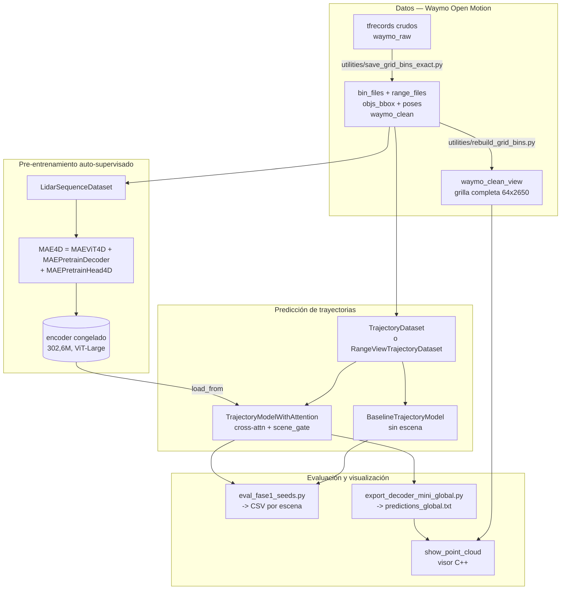

# Mapa del código — MOTF

> Generado por Cartographer con cuatro agentes en paralelo. Último mapeo: 2026-08-30. Modo actualización: auditoría del código nuevo.

**Alcance.** Este mapa cubre el **código propio del proyecto**: 177 archivos, ~192k
tokens. Deja fuera a propósito el `mmpretrain` vendido (cientos de archivos de
ImageNet, CLIP, BLIP, ViG y demás que nunca tocamos) y los datasets. Si buscás algo
que no está acá, probablemente sea código de Sapiens sin modificar.

| grupo | archivos | dónde |
|---|---|---|
| Visor C++ | 10 | raíz del repo |
| Pipeline de datos | 23 | `utilities/` |
| Scripts de experimentos | 59 | `sapiens/pretrain/*.{py,sh}` |
| Núcleo MOTF | 13 | `sapiens/pretrain/mmpretrain/{datasets,models}/` |
| Configs de experimentos | 70 | `sapiens/pretrain/configs/sapiens_mae/lidar/` |
| Hooks de Claude Code | 2 | `.claude/hooks/` |

---

## Panorama del sistema



**La pregunta que el código existe para responder:** ¿la escena LiDAR, codificada
por un MAE auto-supervisado, aporta a la predicción de trayectorias sobre un
baseline puramente cinemático? Toda la arquitectura está montada para medir eso de
forma pareada y controlada.

---

## Las tres líneas de trabajo (leer esto antes que nada)

El repositorio tiene **tres tracks superpuestos** de distintas épocas. Mezclar sus
números es un error que ya se cometió y produjo afirmaciones falsas.

| track | fechas | datos | modelo | evaluador | estado |
|---|---|---|---|---|---|
| **`waymo_10` / attn** | feb–jun | `waymo_10`, escenas `1a…` | `TrajectoryPredictionModel`, `trajectory_attn_*` | `evaluate_*.py` | **muerto** |
| **decoder_mini / Wayformer** | ago 4–18 | `waymo_clean` 25 escenas, range-view rect | `train_decoder_mini.py`, 6785 tokens | `reeval_holdout.py` | paralelo, **congelado** |
| **Fase 1 CV** | ago 23–28 | `waymo_clean` 10 escenas, vóxeles 300 tok / range-view 128 tok | configs `f1cv_*`, `noclip_*`, `geo_*` | **`eval_fase1_seeds.py`** | **VIGENTE** |

De los 59 scripts, **32 están obsoletos**. La tabla completa está más abajo.

---

## Núcleo MOTF

### Datasets

| archivo | clase registrada | rol |
|---|---|---|
| `datasets/lidar_sequence.py` | `LidarSequenceDataset` | pre-entrenamiento MAE sobre vóxeles |
| `datasets/trajectory_dataset.py` | `TrajectoryDataset` | fine-tuning, camino de **vóxeles** |
| `datasets/range_view.py` | `RangeViewTrajectoryDataset` (+2 de pre-entrenamiento) | fine-tuning, camino de **range-view** |

**Flujo de datos — vóxeles.** `.bin` (`float32`, `[x,y,z,intensidad]`) → filtro por
`spatial_range` → voxelización binaria de ocupación (`grid[ix,iy,iz]=1`) → apilado de
`history_len` frames → `reshape(history_len,-1).T` = **`(300 vóxeles, history_len)`**.
Cada vóxel espacial es un token y su feature es su secuencia temporal de ocupación.

**Flujo de datos — range-view.** `.npy` `(64, 2650, 2)` → roll de azimut si hay
augmentación → stride 5 y recorte a 512 columnas → normalizar por `MAX_RANGE=75` →
apilar `history_len` frames como canales → parches 16×16 = **`(128 tokens, 256·history_len)`**.

**Normalización del objetivo** (idéntica en ambos, `trajectory_dataset.py:276-296` y
`range_view.py:178-193`):

1. `relative = centers - ref_center` (`ref_center` = posición en el primer frame)
2. `mean_rel`, `std_rel` calculados **solo con el histórico**, con piso de 0,5 m — evita fuga
3. si `norm_scale` no es `None`, reemplaza `std_rel` por esa constante
4. `relative_norm = (relative - mean_rel) / std_rel`, aplicado a histórico **y** futuro
5. si `clip_norm` no es `None`, recorta a `±clip_norm`

El paso 5 con el default `clip_norm=5.0` truncaba el **32% del futuro**. La
configuración vigente usa `clip_norm=None, norm_scale=10.0`.

### Modelo

| archivo | clase | rol |
|---|---|---|
| `models/backbones/mae_vit_4d.py` | `MAEViT4D` | ViT con patch-embed lineal en vez de convolucional |
| `models/necks/mae_neck.py` | `MAEPretrainDecoder` | decoder MAE (+ fix de grilla no cuadrada) |
| `models/heads/mae_head_4d.py` | `MAEPretrainHead4D` | pérdida: `ocupacion` o `centroide` |
| `models/selfsup/mae_4d.py` | `MAE4D` | orquesta el pre-entrenamiento |
| `models/trajectory_pred/trajectory_model_attn.py` | `TrajectoryModelWithAttention` | **el modelo principal** |
| `models/trajectory_pred/baseline_model.py` | `BaselineTrajectoryModel` | control sin escena |

**Cómo entra la escena al decoder** (`trajectory_model_attn.py:96-134`):

```
_encode_scene(inputs)  ->  latent (B, 300, 1024)     # escena COMPLETA, sin enmascarar
history_proj(historia) ->  query  (B, 1, 1024)
MultiheadAttention(query, latent, latent) -> attn_out (B, 1024)
scene_norm -> scene_proj -> scene_feat (B, 64)        # scene_dim chico a propósito
scene_feat *= tanh(scene_gate)                        # la válvula
decoder(concat(historia_cruda, scene_feat)) -> pred_len*3
```

El `scene_gate` es **un escalar único** para todo el lote y las tres coordenadas.
Converge solo a ~0,07–0,10 desde inicializaciones en 0,5, de forma altamente
reproducible.

**El control de arquitectura.** `freeze_gate=True` con `gate_init=0.0` da un modelo
con **toda la capacidad extra** (cross-attn, proyecciones, mismo decoder) pero con la
escena aportando exactamente cero. Es la única forma limpia de separar "capacidad" de
"escena" — su ausencia confundió las dos cosas durante 14 experimentos.

### Pérdida geométrica (`mae_head_4d.py`)

| `target` | pérdida |
|---|---|
| `'ocupacion'` | MSE contra el token crudo, ponderado por la máscara del MAE |
| `'centroide'` | **L1** sobre `pred[...,:3]` contra los centroides, con máscara doble (`enmascarado ∧ vóxel_con_puntos`) y normalización por magnitud media |

Las tres ideas del modo `centroide` vienen de `pointmap_l1_loss.py` de Sapiens.
`voxel_centroids()` (`lidar_sequence.py:145-168`) deja **`NaN`** en los vóxeles vacíos
a propósito, para que la máscara los descarte.

---

## Configs — familias y cadena encoder→decoder

Las 70 configs se agrupan en familias generadas por scripts. Las vigentes:

| familia | qué es | encoder que carga |
|---|---|---|
| `f1cv_{mae,base,dec}_fold{0..4}` | la CV principal de 5 folds | `f1cv/mae_encoder_fold{F}.pth` (el de su propio fold) |
| `noclip_{base,dec}_fold{0..4}` | sin recorte, escala fija 10 m — el protocolo vigente | `f1cv/mae_encoder_fold{F}.pth` |
| `geo_{mae,base,dec}_fold0` | objetivo geométrico + 7 ventanas | `geo/mae_encoder_fold0.pth` |
| `rvcv_*` / `rvaug_*` | range-view fold 0, sin y con augmentación | `mae_encoder_rangeview.pth` |

**El ViT.** Todas usan `arch='sapiens_0.3b'`, que resuelve a
`embed_dims=1024, num_layers=24, num_heads=16` (`vision_transformer.py:277-283`).
Eso es **ViT-Large con otro nombre** — 302,6 M de parámetros. No hay nada de Sapiens
en juego más allá de la etiqueta: no usamos sus pesos.

### Los folds (control de fuga)

Rotación leave-2-out limpia sobre las mismas 10 escenas. Cada escena cae en
validación **exactamente una vez**:

| fold | validación retenida |
|---|---|
| 0 | `7e2f727866c69ea0`, `82f90331a1dfe968` |
| 1 | `2a81f5233075e987`, `4014ae5bcda2726f` |
| 2 | `2e41fe6faf5cd2ea`, `41692b0ec7ff4123` |
| 3 | `367b072edc9822ea`, `4a2ef30000d19d90` |
| 4 | `394e61f27c2a1700`, `4b60f9400a30ceaf` |

**El encoder de cada fold se pre-entrena solo con las 8 escenas de train de ese fold.**
Usarlo en otro fold sería fuga auto-supervisada. Verificado en el mapeo: **ninguna
config lo hace**.

**Configs huérfanas** (ningún `.sh` las invoca): todo el track `clean25_*`, los
`trajectory_attn_*`, `mae_lidar_*`, `config_rangeview_overfit10`,
`clean10_gated_uncert`, y `clean10_rv_gated_aug{,4}.py` — que además son idénticos
byte a byte salvo el `work_dir`.

---

## Scripts — qué está vivo

**Vigentes** (track Fase 1, ago 23–28):

| script | qué hace |
|---|---|
| `eval_fase1_seeds.py` | **el evaluador**. Separa móviles de parados, agrega por escena |
| `agregar_resultados.py` | **el agregador**. Lee los CSV, declara la convención, hace los t pareados |
| `run_fase1_cv.sh` | CV de 5 folds × 8 semillas × 3 variantes |
| `run_noclip.sh` | fold 0 sin recorte del objetivo |
| `run_geo.sh` | encoder con objetivo geométrico |
| `run_jointmotion.sh` | descongelamiento parcial (`finetune_blocks`) |
| `run_noclip_cv.sh` | **completa la CV de 5 folds** en el protocolo vigente (folds 1-4) |
| `extract_mae_encoder.py` | renombra `backbone.*`→`encoder.*` entre pre-train y decoder |
| `viz_un_auto.py` | trayectoria de un objeto, gate0 vs gated |
| `viz_rect_reconstruction.py` | reconstrucción del MAE, genérico por CLI |
| `export_decoder_mini_global.py` | `predictions_global.txt` + GIFs para el visor |

**Vigentes pero del track congelado** (decoder_mini): `train_decoder_mini.py`,
`cross_validate_decoder.py`, `horizon_sweep.py`, `reeval_holdout.py`,
`angular_error_analysis.py`, `latency_benchmark.py`, `run_gate_sweep.sh`.

**Obsoletos (32):** todos los `evaluate_*.py`, `eval_multi_horizon*.py`,
`eval_uncertainty.py`, `viz_3d_open3d.py`, `viz_clean10.py`,
`viz_dashboard_cpp_style.py`, `viz_mae_reconstruction.py`,
`visualize_bev_trajectories.py`, `export_predictions_{global,clean10,npz}.py`,
`diagnose_{dataset,gate}.py`, `multi_horizon.sh`, `run_{next_session,rangeview,
domain_encoder_experiment,folds_123,fold3_resume,fold4_experiment,gated_folds_1234,
rv_fold0}.sh`.

### Formato de los CSV

| CSV | columnas |
|---|---|
| `*_results.csv` del evaluador vigente | `fold, variant, seed, scene, n_obj, n_moving, ade_all, fde_all, ade_moving, fde_moving, gate` |
| `cv_results.csv` | `fold, seed, arch, ade8, ade5, fde, acc, train_ade8, best_ep, held_out_scenes` |
| `horizon_results.csv` | `fold, seed, arch, horizon_s, n_wp, ade, fde, acc, best_ep` |
| `angular_results.csv` | `fold, seed, arch, n_moving, ang_median, ang_mean, frac_gross, mag_bias` |

---

## Visor C++ y pipeline de datos

**Contrato del visor.** Los `.bin` son floats planos `[x,y,z,range]×N` con **N
obligatoriamente igual a 64×2650** en orden raster (`utils.hpp:14-15`,
`show_point_cloud.cpp:309`). `waymo_clean/bin_files` **viola** ese contrato (bins
dispersos, sin los no-retornos) y rompe el `reshape`.

> **Usar siempre `./show_point_cloud --input waymo_clean_view`**, nunca `waymo_clean`.

**`predictions_global.txt`.** Formato por línea: `scene obj_id kind t x y z`, con
`kind` 0 = histórico, 1 = futuro real, 2 = futuro predicho, en coordenadas globales.
El visor lo busca en el **directorio de trabajo actual**, no en `--input`, y **solo
lo dibuja en el BEV** — no en la range-view.

**Proyección a range-view** (vive en `export_decoder_mini_global.py`, no en el visor):
azimut **espejado** (`yaw = π − 2π·col/W`), elevación por tabla calibrada no uniforme
(`waymo_clean/beam_inclinations.npy`, +0,9° a −14,8°), offset de sensor `z=2,0 m`.

**Marcado en rojo:** test de **punto-en-polígono 2D** sobre la base de la caja más un
techo de altura (`utils.cpp:38-85`). No verifica el piso de la caja.

**Pipeline de datos** (`utilities/`, entorno `waymo_env`): `save_grid_bins_exact.py`
es la extracción oficial desde tfrecords con `pixel_pose`, sin la máscara de filtrado;
`rebuild_grid_bins.py` reconstruye la grilla completa desde los `.npy` de rango.
Dependencias en `requirements.txt`: `tensorflow[and_cuda]`,
`waymo-open-dataset-tf-2-12-0==1.6.4`, `open3d`, `opencv-python`.

---

## Trampas

Ordenadas por lo que cuesta descubrirlas de nuevo. La revisión del 30/08 encontró
13 errores más, verificados uno por uno y arreglados — ver
[REVISION_CODIGO_2026-08-30.md](REVISION_CODIGO_2026-08-30.md). El más grave: la
escena LiDAR estaba desalineada en el tiempo respecto de la trayectoria en el 43%
de los objetos. **Ningún resultado anterior al 30/08 es comparable con los
posteriores.**

1. **Los resultados de los experimentos 15-18 son de UN SOLO FOLD** (el 0). La CV de
   5 folds se está completando desde el 30/08 con `run_noclip_cv.sh`; hasta que
   termine, ningún número de Fase 1 tiene respaldo entre splits.
2. **Agregar los CSV solo con `agregar_resultados.py`**, nunca a mano: la convención
   de promediado cambia el ADE absoluto un 7%.
3. **La evaluación se llama FUERA del guard de reanudación** en todos los `run_*.sh`
   (`run_noclip_cv.sh:88`, y lo mismo en `run_noclip.sh`, `run_geo.sh`,
   `run_jointmotion.sh`), y `eval_fase1_seeds.py:91` abre el CSV en modo `'a'` sin
   comprobar si la fila ya existe. **Relanzar una corrida cortada duplica filas.**
   Una sola fila duplicada mueve la media ponderada ~19%. Verificado el 30/08: los
   CSV existentes están limpios, el bug es latente. `agregar_resultados.py` ya
   deduplica al leer y avisa; falta arreglar el lado de escritura — hacerlo cuando
   termine la corrida en curso, para no tocar un evaluador que se está invocando.
4. **`--resume` anula `load_from`** (`tools/train.py:111`). El arreglo del commit
   `c6c9e05` fue quitar la bandera de los scripts, **no** parchear la herramienta:
   la mina sigue armada para quien la vuelva a agregar.
5. **`ref_center` es inconsistente entre los dos datasets bajo augmentación.** En
   vóxeles se calcula **antes** de rotar (`trajectory_dataset.py:248` vs la llamada en
   la 263); en range-view, después. Hoy es inofensivo porque todos los consumidores
   corren con `augment=False` (`eval_fase1_seeds.py:62`, y los exportadores usan el
   default), pero cualquier evaluación con augmentación daría posiciones absolutas
   incoherentes.
6. **`mask_ratio` en la config del dataset no hace nada.** `lidar_sequence.py:31` lo
   guarda y nunca lo usa; el enmascarado real lee el del backbone. Los dos valores
   conviven sin estar atados.
7. **`history_len` en `MAEViT4D` no significa "cantidad de frames"** en el camino de
   range-view — es la dimensión del parche aplanado (`256·history_len`).
8. **`MAEViT.eval()` devuelve `None`** en este fork. Nunca encadenar `.to(dev).eval()`.
9. **El encoder devuelve los tokens permutados en cada llamada** si no se fija la
   semilla: 69,3% de diferencia elemento a elemento sin semilla, 0,000% con ella.
10. **`_encode_scene` duplica a mano** el forward sin enmascarar que `MAEViT4D.forward`
   ya implementa en su rama de evaluación. Dos implementaciones del mismo cálculo: si
   se cambia una, hay que cambiar la otra.
11. **El decoder MAE del camino de vóxeles no recibe pos-embed sincos** (grilla de 300
   tokens, no cuadrada). Es deliberado, para preservar comparabilidad con el encoder
   del 15/06.
12. **`mae_neck2.py` es una copia sin ese fix** — usarla con 300 tokens revienta en
    `init_weights()` por desajuste de forma.
13. **`TrajectoryPredictionModel` tiene un bug de forma**: las capas intermedias están
    fijas en 512 pero la última usa `hidden_dim` (default 256). Solo funciona con
    `hidden_dim=512`. Está huérfano, así que no muerde.
14. **`RangeViewTrajectoryDataset` sigue exigiendo `bin_files`** aunque su
    `__getitem__` lea `range_files` — hereda `load_data_list` sin sobrescribirlo.
15. **`eval_windows` y `max_windows` solo deben usarse donde corresponde**
    (`eval_windows` en evaluación, `max_windows` en pre-entrenamiento). Ningún assert
    lo impide.

---

## El hueco de reproducibilidad

Es el hallazgo más importante del mapeo y merece su propia sección.

`eval_fase1_seeds.py` escribe **una fila por (fold, variante, semilla, escena)** y se
detiene ahí, deliberadamente: su docstring explica que promediar todas las muestras
juntas fabrica significancia falsa. Correcto.

Pero **nada agrega esas filas después**. El `grep` sobre los nombres de los CSV solo
encuentra los scripts que los escriben. Consecuencias concretas:

- Cada número publicado se calculó a mano en una sesión de análisis, sin quedar
  registrado el método.
- Las dos escenas de validación del fold 0 tienen **200 y 119 objetos**. Promediarlas
  con peso igual o ponderadas da **4,836 vs 5,217** — un 7% de diferencia. Los números
  de la reunión usan la media simple; la ponderada es la defendible.
- La única agregación entre escenas que existe en el código es
  `train_decoder_mini.py:518` (`sum(x)/len(x)`, peso igual por escena) y pertenece al
  track congelado, no al vigente.

**RESUELTO (30/08):** `agregar_resultados.py` lee los CSV, imprime la convención
antes de cada tabla y hace los tests pareados por (fold, semilla).

```
python agregar_resultados.py work_dirs/jm/jm_results.csv              # ponderada (defendible)
python agregar_resultados.py work_dirs/geo/geo_results.csv --peso escena   # reproduce la reunión
python agregar_resultados.py work_dirs/f1cv/f1cv_results.csv --por-fold
```

`--peso objetos` (default) pondera por número de objetos; `--peso escena` da la media
simple que se usó hasta ahora. También `--poblacion moviles`, `--metrica fde`,
`--comparar A:B`. Deduplica filas repetidas, verifica que todas las corridas de un
fold cubran las mismas escenas y tolera celdas vacías, avisando en los tres casos.
El cálculo de `p` es una beta incompleta propia — validada contra
scipy a 1e-15 — para que corra en `sapiens_gpu`, que no tiene scipy.

### Y lo que el agregador encontró al primer uso: TODO ES UN SOLO FOLD

El aviso automático de "un solo fold" saltó en **todos** los CSV del track vigente:

| CSV | folds presentes |
|---|---|
| `f1cv_results.csv` | **solo 0** |
| `noclip_results.csv` | **solo 0** |
| `geo_results.csv` | **solo 0** |
| `jm_results.csv` | **solo 0** |
| `rvcv_results.csv`, `rvaug_results.csv` | **solo 0** |

Existe únicamente `work_dirs/f1cv/mae_encoder_fold0.pth`; las 48 corridas de `f1cv`
son todas del fold 0. **La CV de 5 folds de Fase 1 nunca se corrió.** Los experimentos
15 a 18 — incluido el resultado más firme del proyecto, la capacidad a −10% con 8/8
semillas — descansan sobre **un solo split de escenas**.

Es exactamente el patrón que ya se llevó puestos dos resultados (18/07 y 06/08): un
efecto contundente dentro de un fold que se evapora al promediar los cinco, porque la
varianza entre folds es ~3x la de semillas. Ver `docs/EXPERIMENTOS_DECODER.md`,
experimento 11.

**EN CURSO (lanzado 30/08 00:29):** `run_noclip_cv.sh` completa los folds 1-4 en el
protocolo vigente. Costo **medido**, no estimado: 18,5 min por encoder (fold 0, 24/08
12:05→12:24) y 4 h 47 por tanda de 24 decoders (27/08 17:06→21:53) ≈ 5 h por fold,
~20 h en total. Antifuga verificado antes de lanzar: ninguna escena de validación
aparece en el train ni en el pre-entrenamiento de su propio fold, cada decoder carga
el encoder de su fold, y las 10 escenas cubren validación una vez cada una.
Al terminar: `python agregar_resultados.py work_dirs/noclip/noclip_results.csv
work_dirs/noclipcv/noclipcv_results.csv --por-fold`.

**Segundo hueco relacionado:** ningún script exporta predicciones de los checkpoints
vigentes. El `predictions_global.txt` del repositorio es del **18 de agosto** y viene
del track decoder_mini, no de Fase 1. Lo que muestra el visor **no es el modelo del que
hablan los resultados actuales**.

---

## Automatización (hooks)

Dos reglas del proyecto están puestas en el sistema, no en la memoria de nadie
(`.claude/settings.json`, versionado):

| hook | qué hace |
|---|---|
| `Stop` → `versionar_resultados.py` | busca `work_dirs/**/*results*.csv` sin versionar o modificados y los prepara con `git add -f`. Nace de que `jm_results.csv` se quedó fuera de git y existía solo en este disco |
| `PreToolUse` (Write\|Edit) → `proteger_resultados.py` | rechaza escribir o editar `.csv`/`.pth` dentro de `work_dirs/`. Esos archivos los generan los scripts por Bash, así que un Write ahí solo puede ser un error |

En `.claude/settings.local.json` (no versionado, específico de esta máquina) hay
además notificaciones de escritorio con `notify-send` para pedidos de permiso e
inactividad — útil porque los entrenamientos duran horas.

**Ojo:** `jq` no está instalado en esta máquina; los hooks usan `python3`.

---

## Guía de navegación

**Para correr un experimento nuevo de Fase 1:** copiar `run_geo.sh` como plantilla →
generar configs con el patrón `{base,dec}_fold0.py` → entrenar con `tools/train.py`
→ evaluar con `eval_fase1_seeds.py --eval-windows 7 --sin-clip`.

**Para cambiar cómo entra la escena al decoder:**
`trajectory_model_attn.py:96-134`. Ojo con la duplicación del punto 8 de las trampas.

**Para cambiar el objetivo del pre-entrenamiento:** `mae_head_4d.py` (la pérdida) +
`lidar_sequence.py:145-168` (el cálculo del objetivo) + `geo_target=True` en la config.

**Para tocar la normalización del objetivo:** hay que editar **los dos**
`__getitem__` — `trajectory_dataset.py:276-296` y `range_view.py:178-193`. Es la
trampa que más veces mordió.

**Para regenerar lo que ve el visor:** `export_decoder_mini_global.py` →
`predictions_global.txt` en la raíz → `./show_point_cloud --input waymo_clean_view`.

**Para agregar un fold:** config `f1cv_{mae,base,dec}_fold{F}.py` con su lista de
escenas, y el `load_from` apuntando al encoder **de ese mismo fold**. El generador de
las variantes sin recorte está en la cabecera de `run_noclip_cv.sh`.

**Para publicar cualquier número:** `agregar_resultados.py`, nunca a mano. Declarar la
convención de promediado, el número de folds y el de semillas ANTES de la tabla.
