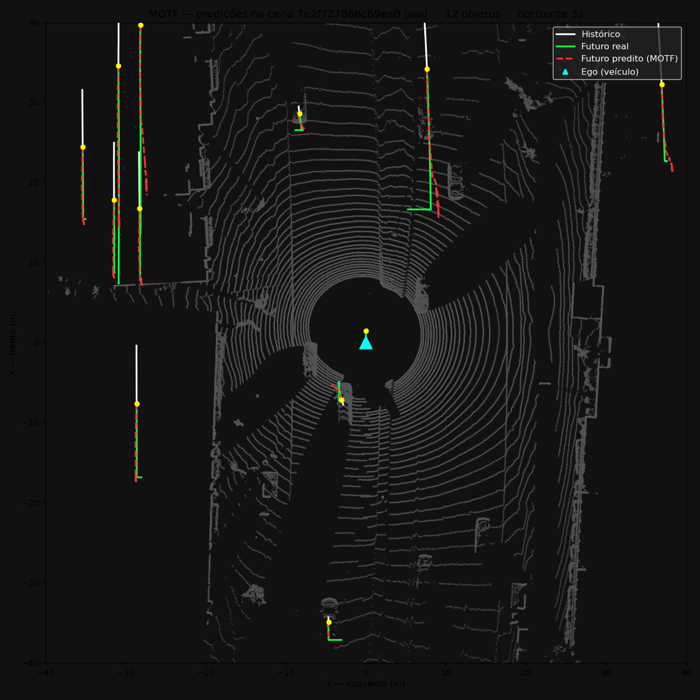
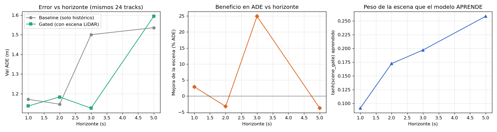
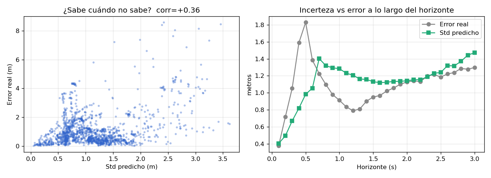

# Predição de Trajetórias Futuras de Objetos Móveis com LiDAR 4D
### Relatório da Fase 1 (waymo_10) — Módulo MOTF

**Autor:** Rivadineira Vargas · **Orientadora:** Profa. Claudine Santos Baduê · LCAD/UFES
**Data:** 16/06/2026

---

## 1. Introdução

Este trabalho desenvolve o módulo **MOTF** (*Moving Object Trajectory Forecaster*),
que prediz trajetórias futuras de objetos móveis (veículos, pedestres) ao redor de um
veículo autônomo a partir de dados de **LiDAR**, para alimentar o subsistema de Tomada
de Decisão do CARMEN-LCAD. Seguindo a inspiração do modelo **Sapiens** (Meta), adaptamos
uma arquitetura *Transformer encoder-decoder* com pré-treinamento mascarado (MAE) para
representar cenas 3D espaço-temporais.

Este relatório cobre a **Fase 1** do protocolo de escalonamento
**10 → 100 → 1000 SWEEPS** (quadros de LiDAR):
> **CORREÇÃO 02/09/2026:** esta linha dizia "cenas". A unidade são SWEEPS — ver
> `docs/CHECKLIST_CLAUDINE.md` (itens 5/6/7/10) e `SESION_ENCODER_VALIDACAO.md:14`.
resultados com 10 cenas limpas (8 treino / 2 validação).

**Ponto de partida.** Este trabalho parte do repositório `lidar_sweep_viewer` de Gabriel
Hendrix (LCAD/UFES — https://github.com/GabrielHendrix/lidar_sweep_viewer), que forneceu a
infraestrutura de base: (a) o *pipeline* de extração do WOMD-LiDAR para o formato
`bin/bbox/poses`; (b) o visualizador C++ `show_point_cloud` (range-view + BEV com *bounding
boxes*), que usamos aqui para inspecionar as predições; e (c) uma representação inicial em
**vóxels** (`voxel_representation`). Nossa contribuição é o **módulo MOTF de predição** em
si — encoder MAE+ViT, decoder *gated*, incerteza — construído sobre essa base.

## 2. Metodologia

**Voxelização 4D do LiDAR (e por quê).** Cada nuvem de pontos é convertida em uma grade de
voxels binária. Empilhando 5 frames consecutivos obtemos um tensor espaço-temporal
(300 voxels = 10×10×3, resolução 2 m, alcance ±10 m). A escolha pela voxelização não é
arbitrária: uma nuvem de pontos é um conjunto **não-ordenado e de tamanho variável**, mas um
*Transformer* precisa de uma **sequência de tokens de tamanho fixo** (como os *patches* de
uma imagem no ViT). A grade de voxels resolve isso — divide o espaço em uma estrutura
**regular e fixa** onde cada voxel é um token, permitindo reusar diretamente a arquitetura
ViT/MAE do Sapiens (projetada para grades de *patches*) sem redesenhá-la. Soma-se a isso que
a base de Gabriel já trazia uma representação em vóxels, tornando a decisão natural.

**Encoder MAE+ViT.** Um *Vision Transformer* (sapiens_0.3b, 24 camadas, ~302 M parâmetros)
é pré-treinado de forma auto-supervisionada por **mascaramento** (MAE): oculta-se 75% dos
voxels e o encoder aprende a reconstruí-los, criando uma representação interna rica da cena
sem necessidade de rótulos.

**Arquitetura *gated cross-attention*.** A história do objeto (5 posições passadas) atende,
via *cross-attention*, à cena codificada pelo encoder. Um **gate aprendível**
`tanh(scene_gate)` controla quanto a cena influencia a predição; um decoder MLP produz as
30 posições futuras (3 s). O encoder fica **congelado** durante o treino do decoder.

**Estimativa de incerteza.** O decoder prediz, por pose, **média e variância**, treinado
com *log-verossimilhança negativa* gaussiana (NLL). Assim cada predição vem acompanhada de
sua confiança — a covariância que o Behavior Selector requer.

## 3. Dados: correção da extração

Os dados originais (extraídos por um colaborador) continham **dois bugs** que os tornavam
em grande parte inutilizáveis:

1. **Associação quebrada:** as *bounding boxes* eram nomeadas por um índice por frame, não
   pelo `track.id` persistente. Quando um objeto sumia, os índices deslizavam e a
   "trajetória" costurava carros diferentes — saltos de 60–124 m entre frames (impossível).
2. **Horizonte limitado a ~1 s** (11 frames), descartando 88% da trajetória.

Re-extraímos os dados do **WOMD-LiDAR oficial** corrigindo ambos (`track.id` persistente +
horizonte de **9 s / 91 frames**). Efeito: os tracks utilizáveis passaram de **29% para
100%**, e as amostras de **103 para 1.395** (13,5×) no mesmo horizonte.

## 4. Resultados (10 cenas, horizonte 3 s)

Métrica: **ADE/FDE** (erro médio/final de deslocamento, em metros, plano XY) na validação
(2 cenas retidas).

**(a) O gate aprende a usar a cena.** Com o gate iniciado em 0 ele nunca abria (candado de
gradiente). Iniciando-o em 0,5, a rama da cena recebe gradiente e o modelo **aprende** a
mantê-lo aberto (estabilizou em 0,20):

| Modelo | Val ADE | Val FDE |
|---|---|---|
| Baseline (só histórico) | 2,013 m | 2,417 m |
| **MOTF gated (com cena LiDAR)** | **1,303 m** | **1,733 m** |
| Melhoria | **−35%** | −28% |

**(b) O benefício da cena cresce com o horizonte.** Treinando a vários horizontes, o peso
da cena que o modelo **aprende** cresce monotonicamente:

| Horizonte | 1 s | 2 s | 3 s | 5 s |
|---|---|---|---|---|
| gate aprendido | 0,091 | 0,172 | 0,197 | 0,259 |

O modelo aprende a confiar mais na cena quanto mais longe prediz — evidência direta, no
mecanismo, de que a cena importa para manobras de médio prazo.

**(c) A incerteza é bem calibrada.** O modelo "sabe quando não sabe":

| Indicador | Resultado | Ideal |
|---|---|---|
| Correlação(std predito, erro real) | +0,36 | > 0 |
| Pontos dentro de ±1σ | 66% | ~68% |
| Pontos dentro de ±2σ | 88% | ~95% |
| Std do passo 1 → passo 30 | 0,41 → 1,47 m | cresce |

## 5. Lições aprendidas e correções

O desenvolvimento foi iterativo e, em retrospecto, vale registrar honestamente os erros e as
correções — eles guiaram as decisões acima:

1. **Tirar conclusões sobre o modelo antes de validar os dados.** Trabalhamos primeiro sobre
   os dados extraídos originalmente (horizonte de ~1 s + bug de associação). Nesse cenário a
   cena LiDAR parecia inútil, e quase concluímos que a arquitetura não ajudava — quando o
   **gargalo real eram os dados**. A lição motivou a re-extração limpa, que mudou tudo.

2. **O gate iniciado em 0 escondeu o benefício.** A inicialização em 0 criava um *candado de
   gradiente*: a rama da cena nunca recebia gradiente e o gate ficava fechado, independente
   de a cena ajudar. Só percebemos ao forçar a cena ativa (que melhorava). A correção foi
   inicializar o gate em 0,5 — mantendo-o aprendível, mas dando-lhe gradiente.

3. **Primeira curva multi-horizonte enviesada.** Comparar horizontes com *tracks* diferentes
   (sobreviventes de cada horizonte) deu uma curva sem sentido físico. Corrigido com
   avaliação **pareada** (mesmos *tracks* em todos os horizontes).

4. **Desvio do protocolo.** Em um momento usamos 25 cenas por conveniência de download, em
   vez das 10 do protocolo; foi realinhado para respeitar a orientação da Fase 1.

## 6. Conclusão e próximos passos

A Fase 1 confirma a hipótese central: **com dados limpos e horizonte longo, a cena LiDAR
melhora a predição de trajetórias** (−35% de ADE na validação), e o modelo **aprende
sozinho** quanto usá-la. Além disso, fornece **incerteza calibrada** por pose, requisito do
Behavior Selector.

**Limitações:** com apenas 2 cenas de validação (24–117 tracks), a curva de ADE por
horizonte é ruidosa (a curva do *gate* não). Isso motiva o escalonamento.

**Próximos passos:** (1) Fase 2 — repetir com **100 cenas**, tornando sólida a curva
multi-horizonte; (2) Fase 3 — **1000 cenas**; (3) fusão de odometria/IMU e predição
multi-objeto; (4) integração ao CARMEN-LCAD.

---

*Reprodutível em `sapiens/pretrain` (`bash run_next_session.sh`). Detalhes em
`docs/RESULTADOS_ADE_FDE.md` e `docs/BUGS_DATOS.md`. Dados limpos: ver README.*
